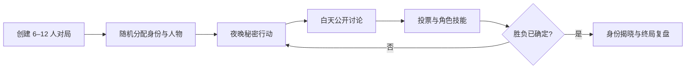
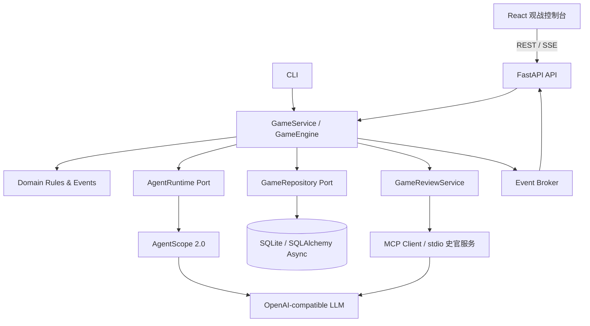

# 群雄夜宴 · AI 狼人杀实时观战平台

> 让多个 AI Agent 在一场完整的三国主题狼人杀中自主推理、发言、欺骗与决策，并把全过程实时呈现在可回放的沉浸式观战控制台中。

`AgentScope 2.0.4` · `OpenAI-compatible` · `FastAPI` · `React` · `SSE` · `SQLite` · `MCP`

## 项目介绍

群雄夜宴不是一段简单的多 Agent 对话脚本，而是一套可运行、可观测、可复盘的 AI 社交推理应用。系统会为 6–12 位三国人物随机分配狼人、预言家、女巫、猎人和村民身份，由大模型驱动每位玩家独立思考，并按照夜晚行动、白天讨论、公开投票和胜负判定推进完整对局。

项目既可以作为 AgentScope 2.0、多 Agent 编排和结构化输出的工程实践，也可以用于课堂演示、模型能力观察、OpenAI-compatible 接口联调，以及实时事件驱动前后端的参考实现。

### 核心体验

| 能力        | 说明                                                                               |
| ----------- | ---------------------------------------------------------------------------------- |
| AI 自主对局 | 每位玩家拥有独立身份、人物性格和上下文，能够自由讨论并完成受 Schema 约束的秘密行动 |
| 沉浸式观战  | 国风棋盘、20 位三国人物立绘、昼夜场景和角色徽记共同呈现 6–12 人对局                |
| 实时事件流  | 发言、阶段切换、投票、查验、用药、淘汰和胜负通过 SSE 逐条推送，无需轮询等待        |
| 双视角观察  | 公开视角保护秘密信息；全知视角展示狼人讨论、投票理由、怀疑值和角色技能             |
| 暂停与复盘  | 支持暂停、倍速、事件定位和终局回放，并可按需生成全知视角史官评局                  |
| 稳健降级    | 单个模型调用失败不会拖垮整局；支持超时、有限重试、并发限制、断线补发和安全错误码   |
| 人物演绎    | 20 位武将拥有独立性格、表达强度、句式与语言习惯，粗豪和克制风格均可自然呈现        |
| 史官 MCP    | 终局后按需生成关键转折、阵营得失、玩家评分、MVP 和国风结语                        |

### 界面预览


对局大厅提供人数选择、一键开局、状态筛选和历史卷宗入口。


全知视角将玩家状态、角色身份、公开发言和秘密行动统一投射到可暂停、可倍速、可定位的事件时间线上。以上画面由离线确定性对局生成，不依赖真实模型服务。

### 一局游戏如何运行



## 技术架构

项目采用模块化单体和端口适配架构。领域规则不依赖 AgentScope、FastAPI、SQLAlchemy 或前端框架，模型、数据库和交付接口均通过应用层端口接入，便于测试与替换。



### 技术栈

| 层次         | 技术                                                | 用途                                             |
| ------------ | --------------------------------------------------- | ------------------------------------------------ |
| Agent 与模型 | AgentScope 2.0.4、OpenAI-compatible API、Pydantic 2 | Agent 会话、自由发言、结构化投票和技能决策       |
| 后端应用     | Python 3.12、FastAPI、asyncio                       | 游戏引擎、后台对局任务、REST、SSE 和生命周期管理 |
| 数据持久化   | SQLAlchemy Async、aiosqlite、Alembic                | 游戏状态、玩家快照、事件序列和数据库迁移         |
| 实时与安全   | SSE、Bearer Token、MCP、JSON 日志                   | 断线补发、管理鉴权、终局复盘和可观测性           |
| 前端         | React 19、TypeScript、Vite、TanStack Query、Zustand | 服务状态、事件队列、播放游标和观战界面           |
| 交互与视觉   | Tailwind CSS、Radix UI、Motion                      | 国风主题、无障碍控件和阶段动画                   |
| 工程质量     | uv、ruff、mypy、pytest、Vitest、Playwright          | 依赖管理、静态检查、单元测试和端到端验证         |

### 项目结构

```text
werewolf_game/
├─ src/werewolf_game/
│  ├─ domain/          玩家、角色、规则、行动 Schema 和游戏事件
│  ├─ application/     游戏引擎、任务服务、端口和事件发布
│  ├─ infrastructure/  AgentScope、OpenAI-compatible、SQLite 和日志适配
│  ├─ mcp/             独立的 stdio 终局史官服务
│  └─ api/             FastAPI、Bearer 鉴权、REST、SSE 和 SPA 托管
├─ frontend/           React 实时观战与终局复盘控制台
├─ tests/              单元、应用、基础设施、API 和 E2E 测试
├─ migrations/         Alembic 数据库迁移
└─ docs/               架构与 MCP 实现说明
```

运行中的 Agent 上下文只保存在当前进程。SQLite 保存游戏状态、玩家快照和完整事件；服务重启后，未完成游戏会标记为 `interrupted`，不会恢复模型上下文。更多设计细节见 [架构说明](docs/architecture.md)。

## 运行环境与配置

- Python 3.12
- uv
- Node.js 20+ 与 npm
- 支持工具调用的 OpenAI-compatible 模型接口

```powershell
uv sync --group dev
npm ci
Copy-Item .env.example .env
```

编辑 `.env`，至少设置：

```dotenv
LLM_API_KEY=your-key
LLM_MODEL_ID=deepseek-chat
LLM_BASE_URL=https://api.deepseek.com
APP_API_TOKEN=replace-with-at-least-24-characters
```

常用配置：

| 环境变量                | 默认值                                   | 说明                       |
| ----------------------- | ---------------------------------------- | -------------------------- |
| `LLM_MODEL_ID`          | 必填                                     | OpenAI-compatible 模型 ID  |
| `LLM_BASE_URL`          | 必填                                     | OpenAI-compatible 接口地址 |
| `LLM_TIMEOUT`           | `60`                                     | 单次模型调用超时（秒）     |
| `HISTORIAN_TIMEOUT`     | `600`                                    | 一次史官任务超时（秒）     |
| `DATABASE_URL`          | `sqlite+aiosqlite:///./data/werewolf.db` | SQLite 地址                |
| `CORS_ORIGINS`          | `[]`                                     | JSON 格式的前端来源白名单  |
| `MAX_CONCURRENT_GAMES`  | `4`                                      | 同时运行的游戏数           |
| `MAX_MODEL_CONCURRENCY` | `8`                                      | 同时执行的模型调用数       |
| `MODEL_MAX_RETRIES`     | `2`                                      | 模型调用重试次数           |
| `WEB_DIST_DIR`          | `frontend/dist`                          | FastAPI 托管的前端构建目录 |

密钥不会写入 API 响应或结构化日志。启动时只输出 API Key 后四位。

## 推荐启动方式

项目有两种启动方式：正常使用时采用“构建前端后由 FastAPI 统一托管”，只有修改源码时才使用热更新开发模式。

### 第一次启动

在项目根目录依次执行：

```powershell
# 1. 安装 Python 和前端依赖
uv sync --group dev
npm ci

# 2. 创建本地配置文件（已经存在 .env 时跳过）
Copy-Item .env.example .env

# 3. 编辑 .env，至少填写 LLM_API_KEY、LLM_MODEL_ID、LLM_BASE_URL、APP_API_TOKEN
notepad .env

# 4. 初始化或升级数据库
uv run alembic upgrade head

# 5. 构建前端
npm run build

# 6. 启动统一服务
uv run werewolf-server --host 127.0.0.1 --port 8000
```

当终端显示 `Uvicorn running on http://127.0.0.1:8000` 后，浏览器访问 `http://127.0.0.1:8000`，输入 `.env` 中的 `APP_API_TOKEN`。

`npm run build` 出现 `Some chunks are larger than 500 kB` 是前端包体积优化建议，不是构建失败。只要最后显示 `built in ...`，就已经成功生成 `frontend/dist`，可以继续启动服务。

### 日常启动（推荐）

使用 FastAPI 同时托管前端和 API，不启用热重载。该方式只有一个访问端口，对局过程中不会因为源码变化自动重启，最适合连续运行多局。

如果依赖、数据库结构和前端代码都没有变化，日常只需要执行：

```powershell
uv run werewolf-server --host 127.0.0.1 --port 8000
```

不需要每天重复运行 `uv sync`、`npm ci`、数据库升级或前端构建。

### 拉取代码或修改代码后启动

拉取新版本后，使用下面这组命令最稳妥。没有变化的步骤会很快完成：

```powershell
uv sync --group dev
npm ci
uv run alembic upgrade head
npm run build
uv run werewolf-server --host 127.0.0.1 --port 8000
```

只修改了后端 Python 代码时可以跳过 `npm run build`；只修改了前端代码时必须重新执行 `npm run build`。令牌只保存在当前浏览器标签页的 `sessionStorage` 中。

启动后可用以下命令检查服务：

```powershell
Invoke-RestMethod http://127.0.0.1:8000/health/live
Invoke-RestMethod http://127.0.0.1:8000/health/ready
```

如果出现 `[WinError 10048]`，表示端口 `8000` 已被另一个服务占用，和模型、MCP、前端构建都无关。先尝试访问 `http://127.0.0.1:8000`；如果旧服务仍然可用，就不需要再次启动。

需要重启服务时，在旧服务所在终端按 `Ctrl+C`。找不到旧终端时，可在 PowerShell 中查询并停止监听进程：

```powershell
$listener = Get-NetTCPConnection -LocalPort 8000 -State Listen
$listener
Stop-Process -Id $listener.OwningProcess -Force
```

确认端口已经释放后再启动：

```powershell
Get-NetTCPConnection -LocalPort 8000 -State Listen -ErrorAction SilentlyContinue
uv run werewolf-server --host 127.0.0.1 --port 8000
```

如果不想停止原服务，也可以临时换端口，例如 `--port 8001`，然后访问 `http://127.0.0.1:8001`。

### 前后端开发模式

只有在修改代码时使用：

```powershell
npm run dev
```

浏览器访问 `http://127.0.0.1:5173`。Vite 负责前端热更新，FastAPI 监听 `8000` 并只对 `src/` 开启后端热重载。

修改后端源码会重启服务，正在运行的对局将标记为 `interrupted`，前端会短暂显示“正在重连”。因此开发模式不适合长时间演示或验证多局稳定性。

控制台支持创建与启动对局、公开/全知视角、实时对话、暂停与倍速播放、跳到最新和终局复盘，并包含 20 位三国人物立绘、5 类身份视觉标识及昼、夜、终局三套场景。

### 纯命令行运行

直接运行一局：

```powershell
uv run werewolf-game run --players 6
```

以可读方式显示全部角色对话和私密行动：

```powershell
uv run werewolf-game run --players 6 --show-dialogue --view god
```

只显示公开讨论和公开结果：

```powershell
uv run werewolf-game run --players 6 --show-dialogue --view public
```

## API

除健康检查外，所有接口要求：

```http
Authorization: Bearer <APP_API_TOKEN>
```

主要接口：

```text
POST /api/v1/games
GET  /api/v1/session
POST /api/v1/games/{id}/start
POST /api/v1/games/{id}/cancel
GET  /api/v1/games
GET  /api/v1/games/{id}?view=public|god
GET  /api/v1/games/{id}/events?after_seq=0&view=public|god
GET  /api/v1/games/{id}/stream?view=public|god
POST /api/v1/games/{id}/review
GET  /api/v1/games/{id}/review
GET  /health/live
GET  /health/ready
```

创建并启动游戏：

```powershell
$headers = @{ Authorization = "Bearer $env:APP_API_TOKEN" }
$game = Invoke-RestMethod `
  -Method Post `
  -Uri http://127.0.0.1:8000/api/v1/games `
  -Headers $headers `
  -ContentType application/json `
  -Body '{"player_count":6}'

Invoke-RestMethod `
  -Method Post `
  -Uri "http://127.0.0.1:8000/api/v1/games/$($game.id)/start" `
  -Headers $headers
```

SSE 支持 `Last-Event-ID` 断线补发。浏览器原生 `EventSource` 无法设置 Authorization Header，前端应使用支持流式 `fetch` 的 SSE 客户端，不要把令牌放入 URL。

默认 `view=public`，不包含身份、狼人讨论、预言家结果和女巫行动；管理端复盘可显式使用 `view=god`。

## 终局史官 MCP

完整设计、调用链和测试说明见 [终局史官 MCP 实现流程](docs/mcp-game-historian.md)。

实时发言不再经过 MCP 审核，也不会被柔化或替换。正常完成或平局后，终局页面显示
“请史官复盘”。用户点击后，应用层整理全知事件卷宗，通过独立 stdio MCP 的
`generate_game_review` 工具按回合分析并生成结构化总评。

复盘与实时游戏完全解耦；MCP 或复盘模型失败不会改变游戏胜负、对话和历史事件。
失败记录可以重试，成功结果持久化后直接复用。

```powershell
uv run werewolf-historian-mcp
```

使用 Inspector 启动并检查 stdio 服务：

```powershell
npx -y @modelcontextprotocol/inspector uv run werewolf-historian-mcp
```

在 Inspector 中确认只有 `generate_game_review` 工具。输出包含关键转折、胜负因素、
逐人 10 分制评价、MVP 和史官结语，所有评价证据必须引用真实事件序号。stdio 协议要求
标准输出只包含 MCP 消息，因此服务日志不会写入 stdout。

## 开发验收

```powershell
uv run ruff check .
uv run ruff format --check .
uv run mypy src
uv run pytest --cov=werewolf_game --cov-fail-under=85
npm run lint
npm run typecheck
npm run test:coverage
npm run build
npm run e2e
```

测试默认使用假模型，不访问外部模型服务。真实模型冒烟必须显式设置 `RUN_LIVE_TESTS=1`，并遵守先输出模型名、Base URL 和脱敏 Key 后缀的约定。结构化投票依赖接口支持 `tools` 和 `tool_choice`。
